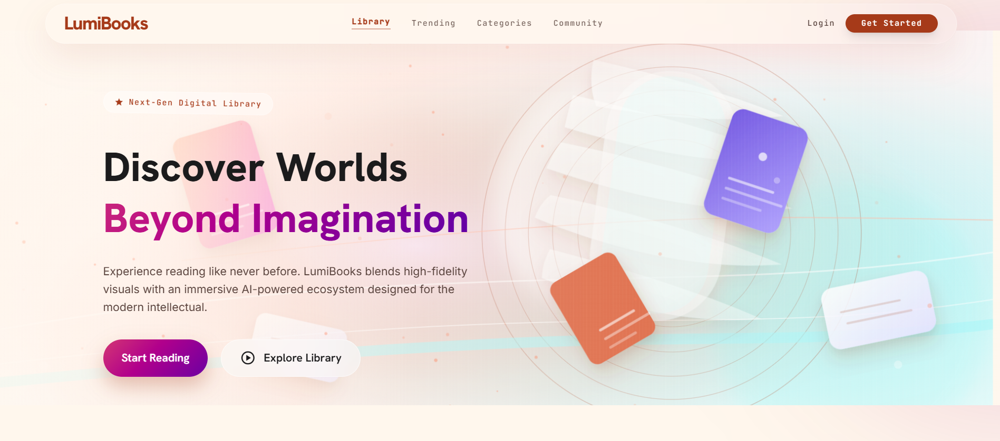
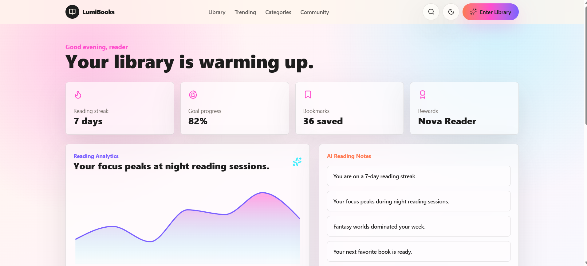
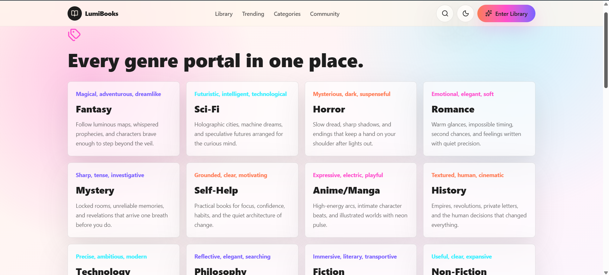
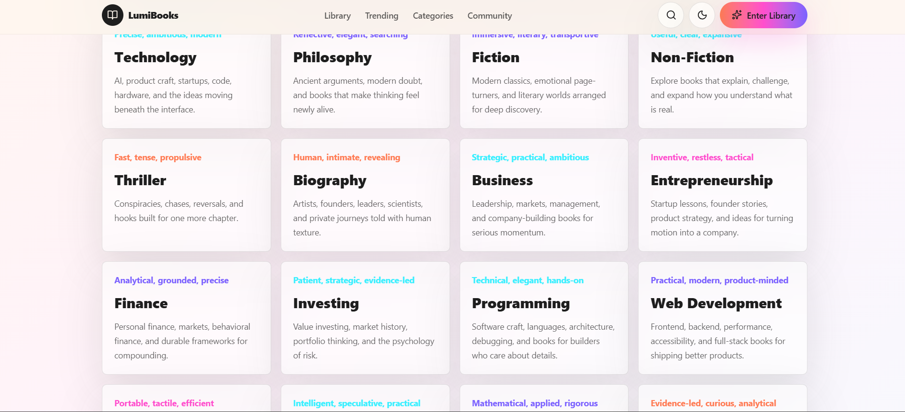
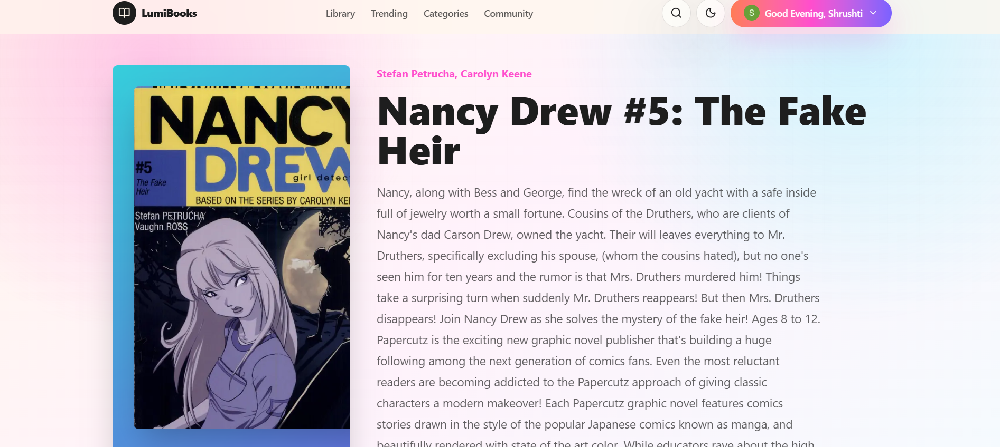
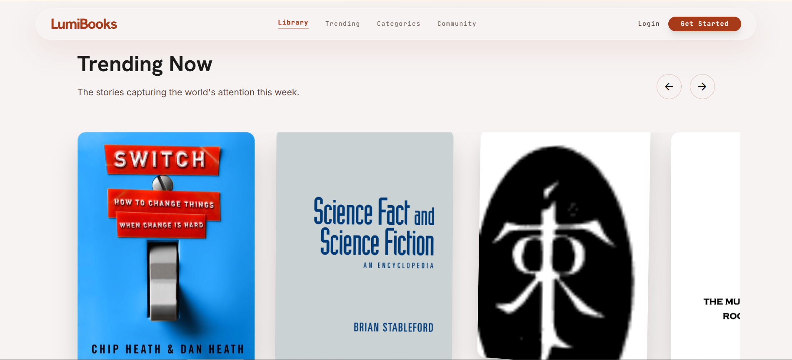
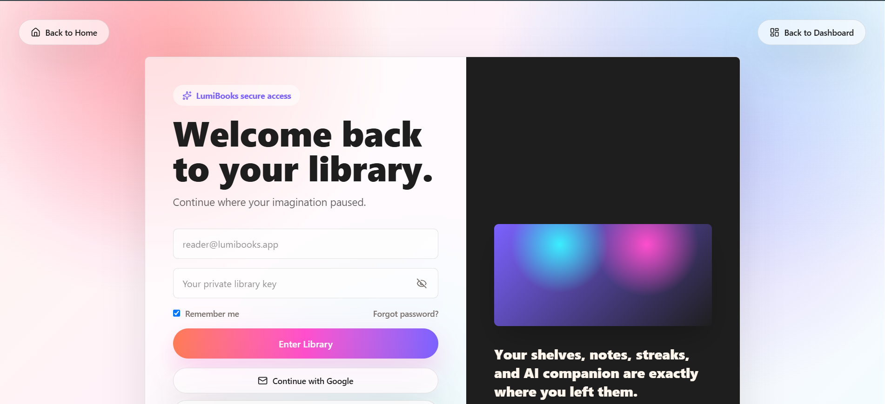
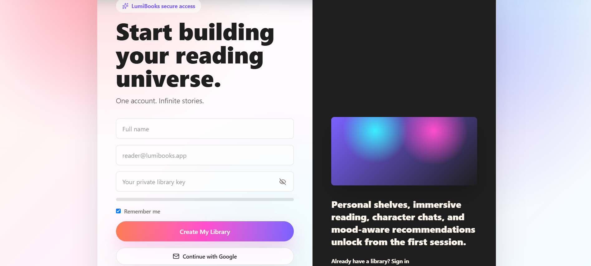

<div align="center">

# 📚 LumiBooks
### AI-Powered Modern Online Book Store & Digital Reading Platform

<p align="center">
A premium full-stack Online Book Store built with <strong>Next.js, TypeScript, Express.js, MongoDB, Clerk Authentication, Google Books API, Cloudinary, Gemini AI, and Tailwind CSS.</strong>
</p>

<p align="center">


</p>

<p align="center">

<a href="https://lumibooks.vercel.app">

</a>

<a href="https://github.com/Shrushti2003">

</a>

<a href="https://www.linkedin.com/in/shrushti-swarnakar/">

</a>

<a href="https://leetcode.com/u/Shrushti2003/">

</a>

</p>

</div>

---

# 🌐 Live Demo

### 🚀 https://lumibooks.vercel.app

---

# 📖 Overview

LumiBooks is a modern AI-powered online bookstore that provides users with an immersive reading experience through an elegant UI, secure authentication, intelligent book discovery, interactive dashboards, digital reading capabilities, and scalable backend architecture.

The platform combines premium design with powerful technologies to create a seamless experience for discovering, managing, and reading books online.

---

# ✨ Key Highlights

✅ Modern Premium UI

✅ Full Stack Architecture

✅ AI Powered Features

✅ Secure Authentication

✅ Responsive Design

✅ Interactive Dashboard

✅ Digital Book Reader

✅ Book Search

✅ Categories

✅ Trending Books

✅ Cloud Image Management

✅ REST API Architecture

✅ Clean Folder Structure

✅ Production Ready

---

# 📸 Application Screenshots

## 🏠 Landing Page



---

## 🏡 Home Page


---

## 📊 Dashboard



---

## 📚 Browse Categories



---

## 📖 Browse Categories Grid



---

## 📕 Book Details



---

## 📖 Reading Experience


---

## 🔥 Trending Books



---

## 🔐 Sign In



---

## 📝 Sign Up



---

# 🚀 Features

### User Features

- Secure Authentication
- Book Discovery
- Browse Categories
- Trending Books
- Responsive Layout
- Reading Interface
- Dashboard
- Premium UI
- Search Books
- Book Details
- Modern Navigation
- Mobile Friendly

---

### AI Features

- AI Book Recommendations
- AI Reading Assistance
- Smart Book Discovery
- Intelligent Suggestions

---

### Admin Ready Architecture

- REST APIs
- Database Models
- Secure Backend
- Authentication Middleware
- Validation
- Error Handling

---

# 🛠 Tech Stack

## Frontend

- Next.js 16
- React 19
- TypeScript
- Tailwind CSS 4
- Framer Motion
- GSAP
- Three.js
- React Hook Form
- TanStack Query
- Radix UI
- Clerk Authentication
- Zod
- Recharts

---

## Backend

- Node.js
- Express.js
- MongoDB
- Mongoose
- JWT
- Clerk Backend
- Joi Validation
- Cloudinary
- OpenAI / Gemini Integration
- Redis
- Multer
- Helmet
- Morgan
- Compression

---

# 🗂 Project Structure

```
LumiBooks
│
├── Frontend
│   ├── app
│   ├── components
│   ├── hooks
│   ├── lib
│   ├── public
│   ├── styles
│   └── utils
│
├── Backend
│   ├── src
│   │
│   ├── controllers
│   ├── middleware
│   ├── models
│   ├── routes
│   ├── services
│   ├── utils
│   └── server.js
│
├── screenshots
├── package.json
└── README.md
```

---

# ⚙️ Environment Variables

Create a `.env` file.

```
NODE_ENV=

PORT=

FRONTEND_URL=

MONGODB_URI=

JWT_SECRET=

GOOGLE_BOOKS_API_KEY=

GEMINI_API_KEY=

REDIS_URL=

CLOUDINARY_CLOUD_NAME=

CLOUDINARY_API_KEY=

CLOUDINARY_API_SECRET=

NEXT_PUBLIC_API_URL=

NEXT_PUBLIC_CLERK_PUBLISHABLE_KEY=

CLERK_SECRET_KEY=
```

---

# 🚀 Installation

## Clone Repository

```bash
git clone https://github.com/Shrushti2003/YOUR_GITHUB_REPOSITORY_NAME.git
```

---

## Go to Project

```bash
cd YOUR_GITHUB_REPOSITORY_NAME
```

---

## Install Dependencies

```bash
npm install
```

---

## Start Development

```bash
npm run dev
```

Frontend

```
http://localhost:3000
```

Backend

```
http://localhost:5000
```

---

# 📦 Build Project

```
npm run build
```

---

# 🔒 Security

- JWT Authentication
- Clerk Authentication
- Secure Middleware
- Environment Variables
- Helmet Protection
- Input Validation
- API Validation
- Error Handling

---

# ⚡ Performance

- Next.js App Router
- Optimized Rendering
- Lazy Loading
- Efficient API Calls
- Responsive UI
- Optimized Assets
- Modern React Architecture

---

# 🎯 Future Improvements

- Book Reviews
- Ratings
- Wishlist
- Reading Progress
- Payment Integration
- Subscription Plans
- Notifications
- Social Features
- Offline Reading
- Dark Mode Enhancements

---

# 🤝 Contributing

Contributions are welcome.

1. Fork the repository

2. Create your feature branch

```
git checkout -b feature/NewFeature
```

3. Commit changes

```
git commit -m "Add New Feature"
```

4. Push

```
git push origin feature/NewFeature
```

5. Open a Pull Request

---

# 👩‍💻 Developer

## **Shrushti Swarnakar**

Full Stack MERN Developer

### GitHub

https://github.com/Shrushti2003

### LinkedIn

https://www.linkedin.com/in/shrushti-swarnakar/

### LeetCode

https://leetcode.com/u/Shrushti2003/

---

# ⭐ Support

If you found this project useful,

please consider giving it a ⭐ on GitHub.

It helps the project reach more developers.

---

# 📄 License

This project is intended for educational and portfolio purposes.

---

<div align="center">

## ⭐ Thank You For Visiting LumiBooks ⭐

Made with ❤️ by **Shrushti Swarnakar**

</div>
