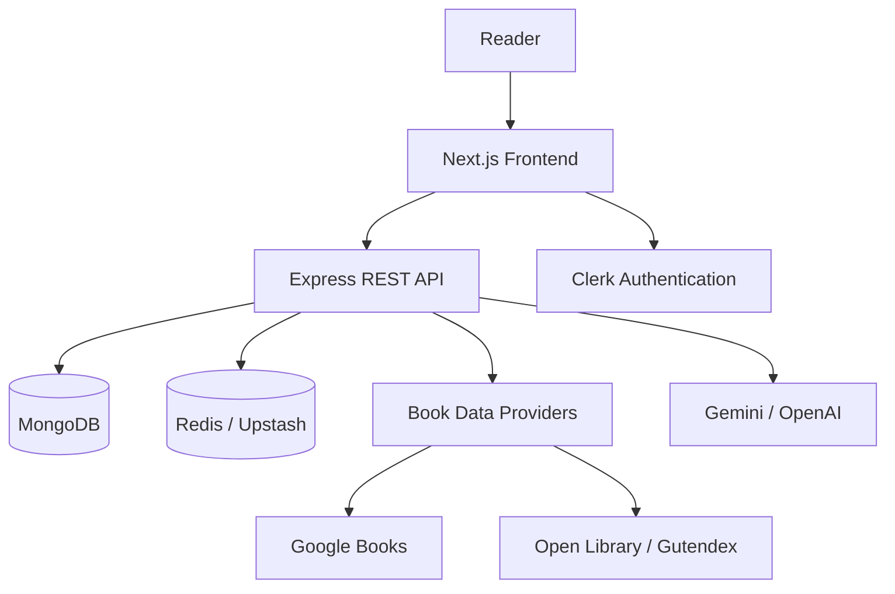

<div align="center">

# 📚 LumiBooks

### Where books become experiences.

A modern full-stack digital reading platform that combines intelligent book discovery, immersive reading tools, personalized libraries, and AI-powered assistance in one cinematic experience.

[](https://lumibooks.vercel.app)
[](https://github.com/Shrushti2003)
[](https://www.linkedin.com/in/shrushti-swarnakar/)

<br />


</div>

---

## 📖 About LumiBooks

**LumiBooks** is a full-stack online book discovery and reading platform designed to make digital reading more interactive, personal, and engaging.

Unlike a traditional bookstore interface, LumiBooks brings together book discovery, reading progress, wishlists, reading history, intelligent recommendations, and AI-powered reading tools within a polished and responsive user experience.

The platform integrates external book data, authentication, persistent user libraries, document reading, and AI assistance through a scalable frontend and backend architecture.

> LumiBooks transforms book discovery from a simple search experience into a personalized digital reading universe.

### 🔗 Quick Links

- **Live Application:** [lumibooks.vercel.app](https://lumibooks.vercel.app)
- **Developer GitHub:** [github.com/Shrushti2003](https://github.com/Shrushti2003)
- **LinkedIn:** [linkedin.com/in/shrushti-swarnakar](https://www.linkedin.com/in/shrushti-swarnakar/)
- **LeetCode:** [leetcode.com/u/Shrushti2003](https://leetcode.com/u/Shrushti2003/)

---

## ✨ Key Features

### 🔍 Intelligent Book Discovery

- Search for books by title, author, keyword, or subject.
- Browse trending books, new releases, categories, and genre collections.
- Retrieve live book information through the Google Books API.
- Explore enriched book data from Open Library, Gutendex, and public-domain sources.
- View detailed descriptions, authors, ratings, covers, and reading availability.

### 🤖 AI-Powered Reading Assistance

- Chat with an AI librarian for personalized reading guidance.
- Generate concise book and passage summaries.
- Explain difficult paragraphs in simpler language.
- Translate selected reading content into another language.
- Extract text from uploaded images using AI-powered OCR.
- Receive recommendations based on mood and reading interests.

### 📖 Immersive Reader

- Distraction-free digital reading interface.
- Read supported public-domain and preview content.
- PDF and EPUB document-reading support.
- Page navigation and reading controls.
- Full-screen reading mode.
- Built-in AI actions accessible from the reading interface.

### 👤 Personalized Reader Experience

- Secure authentication powered by Clerk.
- Personal dashboard with reading insights.
- Save and remove books from a wishlist.
- Maintain reading history and progress.
- Continue reading previously opened books.
- Access profile and preference settings.

### 🎨 Modern User Experience

- Responsive interface optimized for desktop and mobile devices.
- Cinematic landing experience with motion and 3D elements.
- Smooth animations powered by Framer Motion and GSAP.
- Accessible, reusable UI components.
- Custom loading, error, and not-found experiences.
- Carefully designed book cards, carousels, dashboards, and genre worlds.

### 🛡️ Backend Reliability and Security

- RESTful Express API architecture.
- HTTP security headers through Helmet.
- API request rate limiting.
- CORS protection.
- Request compression and structured logging.
- Centralized error and not-found handling.
- MongoDB data persistence with Mongoose.
- Redis and Upstash-compatible caching support.

---

## 🖼️ Application Screenshots

### Landing Experience

<p align="center">
  
</p>

### Home Page

<p align="center">
  
</p>

### Authentication

<table>
  <tr>
    <td align="center"><strong>Sign In</strong></td>
    <td align="center"><strong>Sign Up</strong></td>
  </tr>
  <tr>
    <td></td>
    <td></td>
  </tr>
</table>

### Browse Books and Categories

<table>
  <tr>
    <td align="center"><strong>Browse Categories</strong></td>
    <td align="center"><strong>Category Grid</strong></td>
  </tr>
  <tr>
    <td></td>
    <td></td>
  </tr>
</table>

### Trending Books

<p align="center">
  
</p>

### Book Details

<p align="center">
  
</p>

### Reader Dashboard

<p align="center">
  
</p>

### Immersive Reading Page

<p align="center">
  
</p>

---

## 🛠️ Technology Stack

### Frontend

| Technology | Purpose |
|---|---|
| **Next.js 16** | Full-stack React framework and App Router |
| **React 19** | Component-based user interface |
| **TypeScript** | Static typing and maintainable frontend code |
| **Tailwind CSS 4** | Responsive utility-first styling |
| **TanStack Query** | Server-state management and caching |
| **React Hook Form** | Performant form handling |
| **Zod** | Schema validation |
| **Clerk** | Authentication and user management |
| **Framer Motion** | Interface and page animations |
| **GSAP** | Advanced cinematic animations |
| **Three.js / React Three Fiber** | Interactive 3D visual elements |
| **Lenis** | Smooth scrolling |
| **Recharts** | Dashboard data visualizations |
| **PDF.js** | PDF document rendering |
| **EPUB.js** | EPUB document rendering |
| **Lucide React** | Consistent application icons |

### Backend

| Technology | Purpose |
|---|---|
| **Node.js** | JavaScript server runtime |
| **Express 5** | REST API framework |
| **MongoDB** | Persistent application database |
| **Mongoose** | MongoDB schema and data modelling |
| **Clerk Backend SDK** | Server-side authentication verification |
| **Gemini / OpenAI** | AI-powered reading assistance |
| **Google Books API** | Book discovery and metadata |
| **Open Library & Gutendex** | Public-domain and readable book sources |
| **Redis / Upstash** | Caching and performance optimization |
| **Cloudinary** | Cloud-based media management |
| **Helmet** | Secure HTTP response headers |
| **Express Rate Limit** | API abuse protection |
| **Morgan** | HTTP request logging |
| **Joi and Zod** | Request and data validation |

### Development and Deployment

| Tool | Purpose |
|---|---|
| **npm Workspaces** | Frontend and backend monorepo management |
| **ESLint** | Code-quality checks |
| **Nodemon** | Automatic backend reload during development |
| **Vercel** | Frontend deployment |
| **Git and GitHub** | Version control and source-code hosting |

---

## 🏗️ System Architecture



### Application Flow

1. The reader interacts with the Next.js frontend.
2. Clerk securely handles sign-up, sign-in, and protected-page access.
3. The frontend requests book and library data from the Express API.
4. The backend communicates with MongoDB and optional Redis caching.
5. Book metadata is retrieved from Google Books and other public sources.
6. AI requests are securely processed by the backend.
7. Processed results are returned to the responsive user interface.

---

## 📁 Project Structure

```text
Online-Book-Store/
├── Backend/
│   ├── logs/
│   ├── uploads/
│   ├── src/
│   │   ├── config/          # Database, environment and Redis configuration
│   │   ├── controllers/     # Book, library and AI request handlers
│   │   ├── middleware/      # Authentication and error middleware
│   │   ├── models/          # MongoDB models
│   │   ├── routes/          # REST API endpoints
│   │   ├── services/        # Books, AI and library business logic
│   │   ├── utils/           # Shared backend utilities
│   │   ├── validators/      # Request validation schemas
│   │   ├── app.js           # Express application configuration
│   │   └── server.js        # Backend server entry point
│   └── package.json
│
├── Frontend/
│   ├── public/              # Public assets
│   ├── src/
│   │   ├── app/             # Next.js routes and pages
│   │   ├── components/      # Reusable application components
│   │   ├── config/          # Site configuration
│   │   ├── lib/             # Book services, content and utilities
│   │   ├── providers/       # Global application providers
│   │   └── types/           # TypeScript definitions
│   ├── next.config.ts
│   └── package.json
│
├── screenshots/             # Application screenshots used in this README
├── .env.example             # Environment-variable template
├── docker-compose.yml       # Local MongoDB and Redis services
├── package.json             # Root workspace scripts
└── README.md
```

---

## 🚀 Getting Started

Follow these instructions to run LumiBooks locally.

### Prerequisites

Make sure the following software is installed:

- [Node.js](https://nodejs.org/) — version 20 or later recommended
- [npm](https://www.npmjs.com/)
- [Git](https://git-scm.com/)
- [MongoDB](https://www.mongodb.com/) or a MongoDB Atlas connection
- Redis or Upstash Redis, if caching is required

### 1. Clone the Repository

```bash
git clone https://github.com/Shrushti2003/Online-Book-Store.git
cd Online-Book-Store
```

### 2. Install Dependencies

Run the following command from the project root:

```bash
npm install
```

The project uses npm workspaces, so this installs the required root, frontend, and backend dependencies.

### 3. Create the Environment File

#### Windows Command Prompt

```cmd
copy .env.example .env
```

#### Git Bash, macOS or Linux

```bash
cp .env.example .env
```

### 4. Configure Environment Variables

Open the newly created `.env` file and provide the required credentials:

```env
# Application
NODE_ENV=development
PORT=5000
FRONTEND_URL=http://localhost:3000
NEXT_PUBLIC_API_URL=http://localhost:5000/api

# Database
MONGODB_URI=mongodb://localhost:27017/lumibooks

# Authentication
NEXT_PUBLIC_CLERK_PUBLISHABLE_KEY=your_clerk_publishable_key
CLERK_SECRET_KEY=your_clerk_secret_key
JWT_SECRET=replace_with_a_long_random_secret

# Book data
GOOGLE_BOOKS_API_KEY=your_google_books_api_key

# AI provider
GEMINI_API_KEY=your_gemini_api_key
GEMINI_MODEL=gemini-2.5-flash

# Optional OpenAI provider
OPENAI_API_KEY=your_openai_api_key

# Optional Redis configuration
REDIS_URL=your_redis_connection_url

# Optional Upstash configuration
UPSTASH_REDIS_REST_URL=your_upstash_rest_url
UPSTASH_REDIS_REST_TOKEN=your_upstash_rest_token

# Optional Cloudinary configuration
CLOUDINARY_CLOUD_NAME=your_cloudinary_cloud_name
CLOUDINARY_API_KEY=your_cloudinary_api_key
CLOUDINARY_API_SECRET=your_cloudinary_api_secret
```

> Never commit your actual `.env` file or expose private API keys in GitHub.

### 5. Start Local Infrastructure with Docker — Optional

If Docker is installed, MongoDB and Redis can be started using:

```bash
docker compose up -d
```

### 6. Start the Development Servers

```bash
npm run dev
```

The services will be available at:

| Service | Local URL |
|---|---|
| Frontend | [http://localhost:3000](http://localhost:3000) |
| Backend API | [http://localhost:5000/api](http://localhost:5000/api) |
| Health Check | [http://localhost:5000/health](http://localhost:5000/health) |

---

## 📜 Available Scripts

Run these commands from the project root:

| Command | Description |
|---|---|
| `npm run dev` | Starts the frontend and backend concurrently |
| `npm run dev:frontend` | Starts only the Next.js development server |
| `npm run dev:backend` | Starts only the Express development server |
| `npm run build` | Creates an optimized frontend production build |
| `npm run lint` | Runs ESLint on the frontend |

To start the backend in production mode:

```bash
npm --prefix Backend run start
```

To start the built frontend:

```bash
npm --prefix Frontend run start
```

---

## 🔌 API Reference

### Health Check

| Method | Endpoint | Authentication | Description |
|---|---|---|---|
| `GET` | `/health` | No | Checks whether the API is running |

### Book Endpoints

| Method | Endpoint | Authentication | Description |
|---|---|---|---|
| `GET` | `/api/books/search` | No | Searches books by query |
| `GET` | `/api/books/trending` | No | Retrieves trending books |
| `GET` | `/api/books/genres/:genre` | No | Retrieves books by genre |
| `GET` | `/api/books/:id` | No | Retrieves detailed book information |
| `GET` | `/api/books/:id/read` | No | Retrieves available reading content |

### AI Endpoints

| Method | Endpoint | Authentication | Description |
|---|---|---|---|
| `POST` | `/api/ai/librarian` | Required | Sends a question to the AI librarian |
| `POST` | `/api/ai/summary` | Required | Generates a reading summary |
| `POST` | `/api/ai/summarize` | Required | Alternative summary endpoint |
| `POST` | `/api/ai/explain` | Required | Explains selected reading content |
| `POST` | `/api/ai/translate` | Required | Translates selected text |
| `POST` | `/api/ai/ocr` | Required | Extracts text from an image |

### Library Endpoints

| Method | Endpoint | Authentication | Description |
|---|---|---|---|
| `GET` | `/api/library/dashboard` | Required | Retrieves dashboard information |
| `GET` | `/api/library/progress` | Required | Retrieves reading progress |
| `GET` | `/api/library/wishlist` | Required | Retrieves the reader's wishlist |
| `POST` | `/api/library/wishlist` | Required | Saves a book to the wishlist |
| `DELETE` | `/api/library/wishlist/:id` | Required | Removes a book from the wishlist |
| `GET` | `/api/library/history` | Required | Retrieves reading history |
| `POST` | `/api/library/history` | Required | Records reading activity |

---

## 🔐 Security Practices

LumiBooks applies several security and reliability measures:

- Authentication and protected routes using Clerk.
- Private credentials stored through environment variables.
- HTTP security headers using Helmet.
- Cross-origin request control through CORS.
- API rate limiting to reduce automated abuse.
- Request-body size limits.
- Centralized error handling.
- Backend validation through Zod and Joi.
- Password hashing support through bcrypt.
- Token-based authorization support.
- Production request logging and response compression.

---

## 💡 Engineering Highlights

This project demonstrates experience with:

- Building and organizing a full-stack JavaScript monorepo.
- Developing applications with Next.js App Router and React Server Components.
- Designing reusable, typed React components using TypeScript.
- Creating REST APIs with controllers, services, routes, and middleware.
- Implementing authentication across frontend and backend applications.
- Working with MongoDB schemas and persistent user data.
- Integrating multiple third-party APIs and external content providers.
- Building AI-assisted product features with secure server-side API calls.
- Supporting PDF and EPUB document formats.
- Creating responsive, animated, and user-focused interfaces.
- Managing environment configuration for development and production.
- Deploying a production web application with Vercel.

---

## ❓ Frequently Asked Questions

<details>
<summary><strong>What problem does LumiBooks solve?</strong></summary>

LumiBooks reduces the fragmentation between book discovery, reading, recommendations, and personal library management. Readers can explore books, access available reading content, track their activity, and receive AI assistance without switching between multiple platforms.

</details>

<details>
<summary><strong>Does LumiBooks provide complete books?</strong></summary>

LumiBooks displays metadata and reading content according to availability from external providers. Full reading access is primarily available for supported previews and public-domain titles. Copyrighted books may provide metadata or limited previews only.

</details>

<details>
<summary><strong>How are recommendations generated?</strong></summary>

The platform combines book metadata, genres, mood-based inputs, curated content, and AI assistance to produce more relevant discovery experiences.

</details>

<details>
<summary><strong>Which document formats are supported?</strong></summary>

The document reader includes support for PDF and EPUB content through PDF.js and EPUB.js.

</details>

<details>
<summary><strong>Is authentication required?</strong></summary>

Public book discovery routes can be viewed without authentication. Personalized features such as protected AI tools and user-specific library functionality require authentication.

</details>

<details>
<summary><strong>Are API keys stored in the source code?</strong></summary>

No. Private credentials should be stored only in local or deployment environment variables. The `.env` file is excluded from version control.

</details>

<details>
<summary><strong>Is the application responsive?</strong></summary>

Yes. LumiBooks uses responsive layouts and components designed to work across desktop, tablet, and mobile screen sizes.

</details>

---

## 🤝 Contributing

Contributions, suggestions, and improvements are welcome.

1. Fork the repository.
2. Create a new branch:

```bash
git checkout -b feature/your-feature-name
```

3. Make and test your changes.
4. Commit the changes:

```bash
git commit -m "Add: description of your feature"
```

5. Push the branch:

```bash
git push origin feature/your-feature-name
```

6. Open a pull request with a clear explanation of your changes.

---

## 🐛 Reporting Issues

If you find a bug or have a feature suggestion:

1. Check whether the issue has already been reported.
2. Open a new GitHub issue.
3. Provide clear reproduction steps.
4. Include screenshots or error messages where appropriate.
5. Mention your browser, operating system, and environment.

---

## 👩‍💻 Developer

<div align="center">

### Shrushti Swarnakar

Full-stack developer focused on creating modern, responsive, and user-oriented web applications.

[](https://github.com/Shrushti2003)
[](https://www.linkedin.com/in/shrushti-swarnakar/)
[](https://leetcode.com/u/Shrushti2003/)

</div>

---

## ⭐ Support

If you found LumiBooks interesting or useful:

- Give this repository a **star**.
- Share it with other developers and readers.
- Submit feedback or suggestions through GitHub issues.
- Connect with the developer on LinkedIn.

<div align="center">

### Built with curiosity, creativity, and a love for books.

**[Explore LumiBooks →](https://lumibooks.vercel.app)**

</div>
